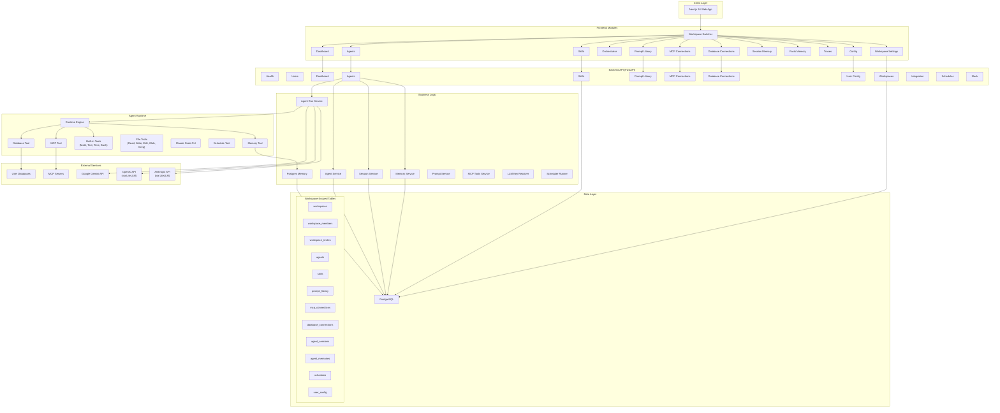
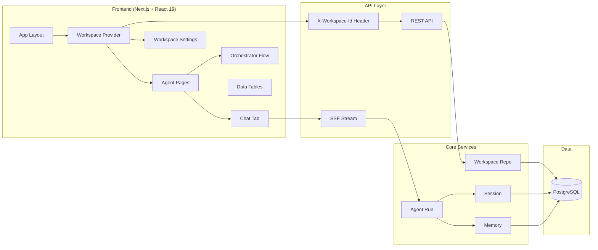
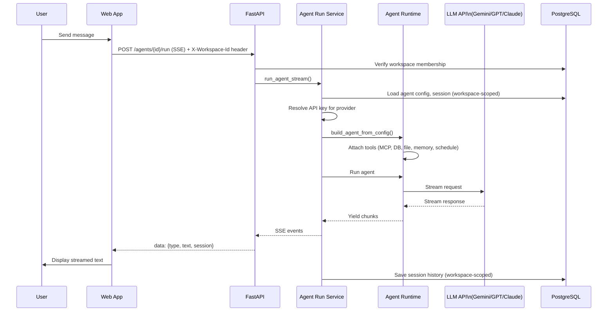
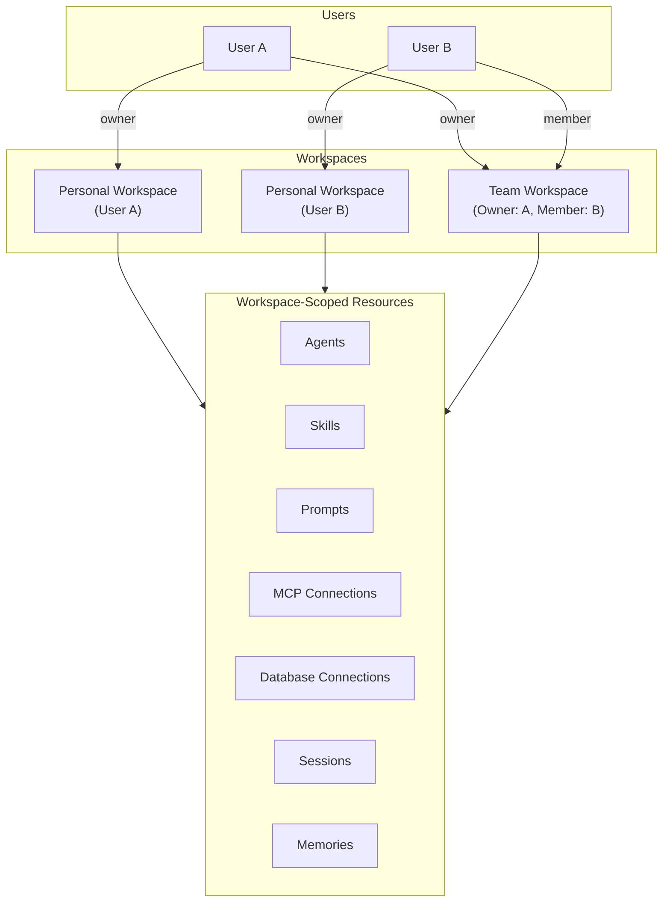

# Atelier — AI Workspace Platform

[](https://opensource.org/licenses/MIT)
[](https://github.com/hiwcode/Atelier-AI-Workspace/stargazers)

> **Project Atelier** is a full-stack AI agent orchestration platform for building, configuring, and managing AI agents with streaming chat, tool integrations, persistent memory, and collaborative workspaces.

**📖 [User Guide →](docs/README.md)** — How to set up and use Atelier

[](web/public/demo.MOV)


### ⭐ Give a Star!

If you find this project useful, please consider giving it a **star** on GitHub — it helps others discover the project and motivates continued development!

[](https://github.com/hiwcode/Atelier-AI-Workspace)

---

## Project Summary

Atelier is an **AI Workspace** that enables users to create and manage AI agents powered by multiple LLM providers (Google Gemini, OpenAI GPT, Anthropic Claude). It provides a unified interface for configuring agents, connecting external tools (MCP, databases, file system, Claude Code CLI), scheduling automated runs, orchestrating multi-agent workflows, and maintaining conversation history with semantic memory extraction — all organized into collaborative **workspaces** for teams and individuals.

### Key Highlights

- **Multi-LLM support** — Google Gemini (native), OpenAI GPT, Anthropic Claude via LiteLLM — per-user API keys with env fallback
- **Workspaces** — Personal and team workspaces with role-based access control (Owner / Admin / Member), invite system, and resource transfer
- **Agent builder** — Create local or A2A (Agent-to-Agent) agents with configurable system prompts, instructions, and tools
- **Skills** — Reusable capability definitions (instructions + tools) that can be attached to multiple agents
- **Streaming chat** — Real-time SSE streaming with conversation history and session persistence
- **Orchestrator** — Visual flow editor (React Flow) for designing multi-agent workflows with sub-agents
- **Tool integrations** — MCP connections, PostgreSQL database tools, file system tools, Claude Code CLI, built-in tools (math, text, time, bash)
- **Scheduling** — One-time and recurring (cron) scheduled agent runs with background execution
- **Memory system** — Session memory, facts memory with automatic extraction from conversations
- **Slack integration** — Route Slack messages to agents, post responses back to threads
- **Observability** — Opik tracing, MCP tester, and dashboard analytics
- **Auth** — Google OAuth and API key authentication

---

## System Architecture



---

## Component Diagram



---

## Data Flow: Chat & Agent Execution



---

## Workspace & Multi-Tenancy Architecture

All resources are scoped to **workspaces** — isolated containers for collaboration.



| Concept | Details |
|---------|---------|
| **Personal workspace** | Auto-created on first sign-in; one per user; cannot be deleted |
| **Team workspace** | Created manually; supports Owner / Admin / Member roles |
| **Workspace scoping** | All CRUD operations filter by the active workspace (`X-Workspace-Id` header) |
| **Invite system** | Email-based invites with expiry; accept via token link |
| **Resource transfer** | Atomic transfer of resources (agents, prompts, connections) between workspaces |
| **Access control** | Membership checked on every request; non-members get 404 |

---

## Tech Stack

| Layer | Technology |
|-------|------------|
| **Frontend** | Next.js 16, React 19, TypeScript, Tailwind CSS, Radix UI, React Flow (@xyflow/react), Recharts |
| **Backend** | FastAPI, Python 3.10+ |
| **AI/LLM** | Google ADK (Agent Development Kit), Gemini API, LiteLLM (OpenAI, Anthropic) |
| **Database** | PostgreSQL, asyncpg |
| **Auth** | Google OAuth (@react-oauth/google), JWT, API keys |
| **Tools** | FastMCP (MCP connections), database tool, file system tools, Claude Code CLI, croniter (scheduling) |

---

## Feature Breakdown

| Feature | Description |
|---------|-------------|
| **Workspaces** | Personal and team workspaces with role-based access (Owner/Admin/Member), invite system, and resource transfer between workspaces |
| **Agents** | Create local agents (Gemini, GPT, Claude) or A2A agents; configure model, system prompt, instructions, and tools — all workspace-scoped |
| **Skills** | Reusable capability definitions (instructions + tools) attachable to agents; workspace-scoped and shareable across agents |
| **Chat** | Streaming chat with session history, auto-select first session, delete sessions |
| **Orchestrator** | Visual editor for orchestrator agents; add/remove sub-agents (local or external A2A) |
| **Prompt Library** | Reusable prompt templates referenced by agents — workspace-scoped |
| **MCP Connections** | Connect to MCP servers (GitHub, Jira, Slack, etc.); select tools per agent — workspace-scoped |
| **Database Connections** | PostgreSQL connections for SQL tools (read-only or read-write) — workspace-scoped |
| **File Tools** | Read, write, edit, search files on the host machine (restricted to ~/Desktop) |
| **Claude Code** | Delegate complex coding tasks to local Claude Code CLI (no API cost) |
| **Schedules** | One-time and recurring (cron) scheduled agent runs with background execution — workspace-scoped |
| **Slack** | Route Slack messages to agents, auto-respond in threads |
| **Session Memory** | Browse and search conversation history — workspace-scoped |
| **Facts Memory** | Extract and store user preferences/facts from conversations — workspace-scoped |
| **Traces** | View execution traces |
| **MCP Tester** | Test MCP connections and tools |
| **Dashboard** | Overview with token usage, session counts, agent stats — per workspace |
| **Config** | Multi-provider API keys (Google, OpenAI, Anthropic), Opik observability, Slack integration |

---

## Project Structure

```
Atelier/
├── app/                        # FastAPI backend
│   ├── api/v1/endpoints/       # REST endpoints
│   │   ├── workspaces.py       # Workspace CRUD, members, invites, transfer
│   │   ├── agents.py           # Agents (workspace-scoped)
│   │   ├── skills.py           # Skills (workspace-scoped)
│   │   ├── integration.py      # Integration API for agent/session management
│   │   └── ...                 # Other endpoints
│   ├── agents/                 # Agent runtime, tools (DB, MCP, file, schedule, Claude Code)
│   ├── core/                   # Config, security, access control
│   ├── db/migrations/          # SQL migrations (001-027)
│   ├── repositories/           # Data access layer
│   │   ├── workspace_repo.py   # Workspace data access
│   │   └── ...                 # Other repos
│   ├── schemas/                # Pydantic request/response schemas
│   │   ├── workspace.py        # Workspace DTOs
│   │   └── ...
│   └── services/               # Business logic
├── web/                        # Next.js frontend
│   ├── app/(protected)/        # Auth-protected routes
│   │   ├── workspace/settings/ # Workspace management UI
│   │   ├── invite/             # Invite acceptance flow
│   │   └── ...                 # Other pages
│   ├── components/
│   │   ├── workspace/          # Workspace provider, transfer dialog
│   │   └── ...                 # Other components
│   └── lib/api/
│       ├── workspaces.ts       # Workspace API client
│       └── ...
├── docs/                       # Documentation & guides
└── pyproject.toml              # Python deps (uv)
```

---

## License

This project is licensed under the **MIT License** — see the [LICENSE](LICENSE) file for details.

---

<p align="center">
  Made with ❤️ by <a href="https://github.com/hiwcode">hiwcode</a>
</p>


<!-- Handy commands:
- Logs: docker compose logs -f api
- Stop: docker compose down (add -v to also wipe the DB volume)
- Rebuild after code changes: docker compose up -d --build -->