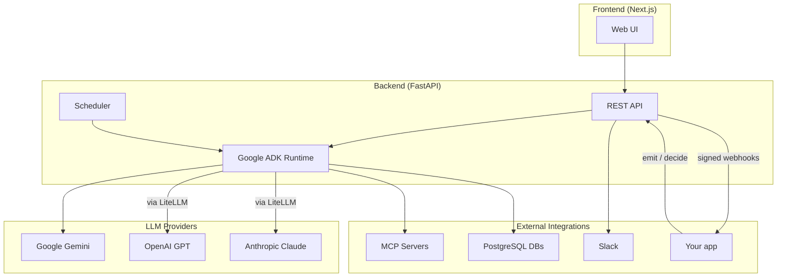

# KRIY

A source-available workspace for building, managing, and orchestrating AI agents. KRIY gives teams a unified platform to create agents powered by **Google Gemini**, **OpenAI GPT**, and **Anthropic Claude** — with collaborative workspaces, scheduling, memory, and extensible tooling.

Build agents and give them the tools to *do* work — MCP tools, skills, orchestration, and schedules — then let your app's events trigger the right agent automatically, check a decision gate before it acts, and get the result posted back over a signed webhook.

---

## Key Capabilities

| Capability | What it does |
|------------|-------------|
| **Multi-LLM Agents** | Create agents with Gemini, GPT, and Claude models; select a model per agent |
| **Skills** | Bundle reusable instructions and tools into shareable skill packs |
| **Orchestrator** | Design multi-agent workflows with a visual canvas |
| **Tools & MCP** | Built-in tools, file system access, Claude Code, shell, MCP servers, databases |
| **Schedules** | Run agents on cron schedules or one-time triggers |
| **Memory** | Short-term session context plus auto-extracted long-term facts |
| **Triggers** | Your app emits an event; the matching workflow runs the right agent |
| **Gates** | Ask before you act — rules return an allow/deny verdict inline |
| **Webhooks** | KRIY posts results back to your app, HMAC-signed and replayable |
| **Workspaces** | Personal and team workspaces with role-based access |

---

## Documentation

### Getting Started

| Guide | Description |
|-------|-------------|
| [Setup Guide](getting-started.md) | Prerequisites, installation, environment variables, and first run |
| [Integrate KRIY in 15 Minutes](integration-quickstart.md) | End-to-end external app integration with events, workflows, gates, results, and webhooks |
| [Integration API Reference](integration-api-reference.md) | Authentication, workspace scoping, contracts, errors, retries, webhooks, and security |

### Core Features

| Guide | Description |
|-------|-------------|
| [Agents](using-agents.md) | Create agents, configure models, chat, and manage sessions |
| [Skills](using-skills.md) | Create reusable skill definitions and attach them to agents |
| [Tools & Prompts](using-tools.md) | Built-in tools, file tools, Claude Code, MCP connections, databases, prompt library |
| [Memory](using-memory.md) | Session context and intelligent long-term fact extraction |

### Advanced

| Guide | Description |
|-------|-------------|
| [Orchestrator](using-orchestrator.md) | Build multi-agent flows with visual coordination |
| [Schedules](using-schedules.md) | One-time and recurring automated agent runs |
| [Triggers](using-event-workflows.md) | React to events from your app — emit an event, an agent handles it |
| [Gates](using-gates.md) | Synchronous allow/deny rules your app checks before it acts |
| [Webhooks](using-webhooks.md) | Signed outbound events — run results delivered back to your app |
| [Notifications](using-notifications.md) | Live in-app notifications + the `notify` agent tool |
| [Workspaces](using-workspaces.md) | Personal and team workspaces, roles, invitations, resource scoping |
| [Workspace Transfer](workspace-transfer.md) | Move agents and resources between workspaces via API |

### Settings

| Guide | Description |
|-------|-------------|
| [Configuration](using-profile.md) | Multi-provider API keys, default model, Opik tracing, Slack integration |

---

## Quick Start

1. **Install** — Clone the repo, run `uv sync` (backend) and `npm install` (frontend)
2. **Configure** — Set `DATABASE_URL` and at least one LLM API key in `.env`
3. **Start backend** — `uv run uvicorn app.main:app --port 8000`
4. **Start frontend** — `cd web && npm run dev`
5. **Sign in** — Google OAuth or API key authentication
6. **Create an agent** — Go to Agents, create one, pick a model, and start chatting

See the [Setup Guide](getting-started.md) for detailed instructions.

---

## Architecture

