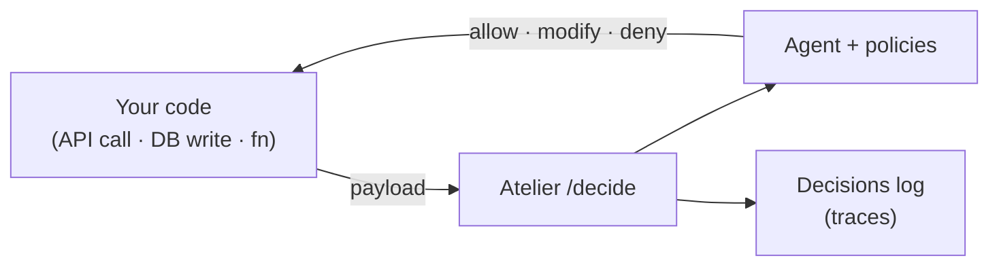

# Embedding Agents (SDK)

Put an agent in the path of code you already have. Your app's API calls, DB writes, and
function calls flow through the agent, which can **observe**, **modify**, or **deny** them
before they happen — no rewrite required, added one call site at a time.

> This is the **embed** half of Atelier. For the **build** half — giving an agent tools to do
> work (MCP tools, skills, orchestration, schedules) — see the [Overview](README.md).



---

## Install

```bash
pip install atelier-agentic          # Python (zero deps)
npm install @atelier/agentic         # Node 18+ / TypeScript
```

Get an API key from **Config → API Access** and set `ATELIER_API_KEY` (and `ATELIER_BASE_URL` if self-hosted).

---

## Quickstart

Wrap any payload with `guard()` before you use it. It returns the payload to actually use — or throws on a denied action in `enforce` mode.

**Python**

```python
from atelier_agentic import AtelierClient

atelier = AtelierClient(agent_id=12, api_key="sk_...", mode="observe")

order = atelier.guard(
    "db.update", order,
    mutable_fields=["discount"],     # the agent may only change these keys
    context={"table": "orders"},
)
db.update(order)
```

**Node / TypeScript**

```ts
import { AtelierClient } from "@atelier/agentic";

const atelier = new AtelierClient({ agentId: 12, apiKey: "sk_...", mode: "observe" });

const order = await atelier.guard("db.update", order, {
  mutableFields: ["discount"],
  context: { table: "orders" },
});
await db.orders.update(order);
```

---

## Modes — roll out safely

| Mode | Behaviour |
|------|-----------|
| `observe` | **Shadow mode.** Logs what the agent *would* do; your call runs unchanged. Zero risk. |
| `suggest` | Returns the original payload; the verdict is surfaced for review. |
| `enforce` | Applies the verdict — **deny** throws (`AtelierDenied`), **modify** returns the new payload. |

Start in **observe**, watch the verdicts in the agent's **Decisions** tab, then graduate specific call sites to **enforce**.

---

## Auto-instrumentation

Guard every outbound JSON call without touching each call site.

```python
from atelier_agentic import install_requests
install_requests(atelier, methods=["POST", "PUT"])   # patches requests
```

```ts
import { installFetch } from "@atelier/agentic";
const uninstall = installFetch(atelier, { methods: ["POST", "PUT"] });  // patches global fetch
```

---

## The rest of the SDK

`guard()` is the common case, but the SDK exposes the full decision surface.

### `decide` — get the verdict without applying it

Inspect what the agent would do (decision, reason, confidence, whether it changed the payload) and decide for yourself.

```python
v = atelier.decide("http.post", body, schema=ORDER_SCHEMA)
print(v.decision, v.reason, v.confidence, v.changed)
```

```ts
const v = await atelier.decide("http.post", body, { schema: ORDER_SCHEMA });
console.log(v.decision, v.reason, v.confidence, v.changed);
```

### `wrap` / `@intercept` — guard a function

Wrap a function so its payload argument is guarded before it runs.

```python
@atelier.intercept("fn.charge", mutable_fields=["amount"])
def charge(payload):
    return gateway.charge(payload)
```

```ts
import { wrap } from "@atelier/agentic";

const charge = wrap(atelier, "fn.charge", (p) => gateway.charge(p), {
  mutableFields: ["amount"],
});
await charge({ card, amount: 100 });
```

### `emit` — fire-and-forget an event

Where `guard`/`decide` sit *in the path* of one action, `emit` reports that **something happened** and lets Atelier run whatever server-side **workflows** match it (each picks its own agent). No `agent_id` needed. See [Event Workflows](using-event-workflows.md) for the full flow.

```python
atelier = AtelierClient(api_key="ate-...")          # no agent_id required for emit
atelier.emit("todo.completed", {"todos": todos})
# -> {"event": "todo.completed", "matched": 2, "run_ids": [...]}
```

```ts
const atelier = new AtelierClient({ apiKey: "ate-..." });
await atelier.emit("todo.completed", { todos });
```

### `trigger` — run a full agent turn

Fire an event at **this client's agent** and let it react through its own tools (a full agent turn). Returns the agent's text response.

```python
summary = atelier.trigger("todo.completed", context={"todos": todos})
```

```ts
const summary = await atelier.trigger("todo.completed", { context: { todos } });
```

---

## The verdict contract

Every decision point hits one endpoint:

```
POST /api/v1/integration/agents/{agent_id}/decide
Header: X-API-Key: <key>
```

Request:

```jsonc
{
  "action": "db.update",                 // what's about to happen
  "payload": { "id": 1, "discount": 80 },
  "schema":  { "type": "object" },        // optional JSON Schema (validates modifications)
  "context": { "table": "orders" },       // optional
  "mutable_fields": ["discount"],          // optional allowlist (null = any, [] = none)
  "mode": "enforce"
}
```

Response (safety-railed server-side):

```jsonc
{
  "decision": "allow | deny | modify",
  "payload": { "id": 1, "discount": 50 },  // only allowed keys changed
  "original_payload": { "id": 1, "discount": 80 },
  "changed": true,
  "reason": "Discount cap: clamped discount to 50",
  "confidence": 0.9,
  "applied_policies": ["Discount cap"],
  "latency_ms": 320
}
```

---

## Policies — bound what the agent may do

Per-call-site detail lives in your code (`action`, `mutable_fields`, `schema`). **Cross-cutting guardrails** live once on the agent's **Policies** tab and are enforced **deterministically** on every decision (no LLM in the path):

- Natural-language **guidance** is injected into the agent's prompt.
- Structured **rules** are enforced server-side. Ops: `max`, `min`, `mask`, `redact`, `deny_above`, `deny_below`, `deny_if_present`, `required`, `allow_values`, `deny_if_contains`, `deny_if_equals`, `deny_if_matches` (regex).

Example: *"discounts ≤ 50%, mask emails, deny refunds over $1,000."* A policy may only change keys in `mutable_fields`; a modified payload that fails the supplied `schema` is reverted.

> **Rule-only policies skip the model entirely.** If the action is governed by
> deterministic rules (no `guidance`), the verdict is computed in code in ~0 ms —
> no LLM call, no quota. The model is only consulted when a matching policy has
> natural-language guidance, or when no policy covers the action.

### Conditions — scope a policy to *when* it applies

Each policy has an optional **WHEN** clause: a list of `conditions` plus a
`match` of `all` (AND) or `any` (OR). The policy only applies when its conditions
match the merged **payload + `context`**. Empty conditions = always applies.

Condition ops: `equals`, `not_equals`, `contains`, `matches`, `in`, `gt`, `lt`.

This is how you scope a rule to a single tenant/user when one agent serves many.
Pass the caller in `context`, then gate the policy on it:

```python
# your code — identify the end user
atelier.guard("todo.complete", {"name": name}, context={"user": current_user})
```

```
Policy:  WHEN user == "alice" (match all)  THEN name deny_if_contains "Standup"
```

Now only Alice is blocked from completing "Standup" todos; everyone else passes —
still deterministically, in ~0 ms. (Conditions rely on your app sending an honest
`context`; for a hard security boundary between separate customers, give each one
its own Atelier API key.)

---

## Decisions & AI-proposed policies

- Every `/decide` verdict is recorded in the agent's **Decisions** tab — filter by allow/modify/deny, inspect before/after payloads and which policies fired. This is what makes **observe** mode useful.
- From recent decisions the agent can **propose policies** ("Suggest" in the Policies tab) that generalize observed patterns. You approve them, and they then run as fast, deterministic rules — so you don't hand-author rules for hundreds of endpoints.

---

## Safety rails

- The agent may only change keys listed in `mutable_fields`.
- Modified payloads are validated against the provided `schema` (reverted on failure).
- Network/timeout errors **fail open** (return the original payload) unless `fail_open=False`.
- Every decision is logged for audit.
