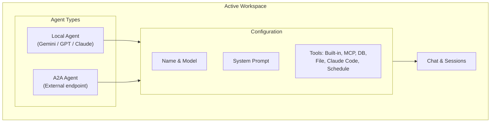
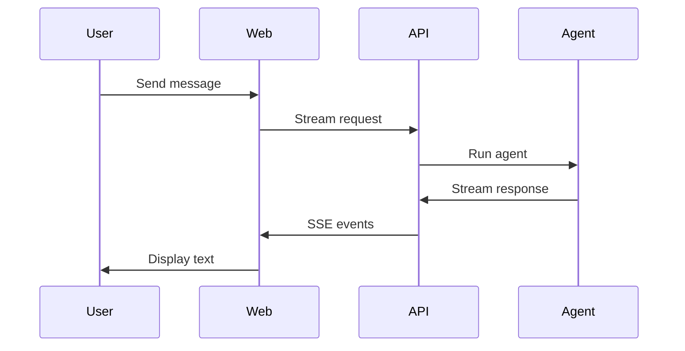

# Agents

## Overview

Agents are AI assistants powered by LLMs from multiple providers (Google Gemini, OpenAI GPT, Anthropic Claude). You can create **local agents** (run on this server) or **A2A agents** (external Agent-to-Agent endpoints). All agents belong to a **workspace** — see [Using Workspaces](using-workspaces.md) for details.

---

## Create an Agent

1. Go to **Agents** in the sidebar
2. Click **New agent**
3. Fill in:
   - **Name** — Display name
   - **Model** — Choose from any supported provider:
     - Google: `gemini-3.1-flash-lite`, `gemini-2.5-pro`, `gemini-2.0-flash`
     - OpenAI: `gpt-4o`, `gpt-4o-mini`, `o3-mini`
     - Anthropic: `claude-sonnet-4-20250514`, `claude-haiku-4-20250414`
   - **System prompt** — Base instructions (or choose from Prompt Library)
   - **Instruction** — Additional instructions
   - **Tools** — Built-in, MCP, database, file tools, Claude Code, schedule
4. Click **Save**

---

## Chat with an Agent

1. Open an agent (click its row or card)
2. Go to the **Chat** tab
3. Use the message input at the bottom
4. Responses stream in real time

### Session Management

- **New conversation** — Click the **+** in the Conversations header
- **Select session** — Click a conversation in the sidebar to load it
- **Delete session** — Hover over a conversation and click the trash icon
- **First session** — The first conversation is selected by default when you open the Chat tab

---

## Agent Configuration

### Configuration tab

| Field | Purpose |
|------|---------|
| **Name** | Display name |
| **Label** | Short label |
| **Model** | LLM model (Gemini, GPT, Claude) |
| **System prompt** | Main identity/behavior |
| **Instruction** | Extra instructions |
| **Tools** | Built-in, MCP, database tools |
| **Skills** | Reusable capabilities (instructions + tools) — see [Using Skills](using-skills.md) |

### Tools

- **Built-in** — Math, text, time, bash, and more
- **File tools** — Read, write, edit, glob, grep files on the host (restricted to `~/Desktop`)
- **Claude Code** — Delegate complex coding tasks to your local Claude Code CLI
- **Schedule** — Create, list, delete scheduled agent runs
- **MCP** — Connect to MCP servers (GitHub, Jira, Slack, etc.)
- **Database** — Run SQL against configured PostgreSQL connections

See [Using Tools](using-tools.md) for the full list.

---

## History Tab

- View all past sessions for this agent
- Search by title
- Click a session to open it in the Chat tab

---

## Workspace Scoping

- Agents are scoped to the **active workspace** — you only see agents belonging to the workspace selected in the sidebar
- When you create an agent, it is assigned to the active workspace
- Agent sessions and memories are also workspace-scoped
- You can [transfer agents](workspace-transfer.md) between workspaces (their sessions and memories move with them)
