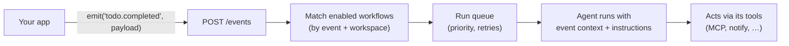

# Triggers

Triggers connect an **external app** to your agents. When your app emits an event
(e.g. `todo.completed`), KRIY runs the matching agent automatically to handle it — no
code in your app beyond a one-line `emit`.

> Not to be confused with the **Orchestrator** (visual multi-agent flows) or **Schedules**
> (time-based runs). Triggers are **event-driven**: something happens in your app →
> an agent reacts.



There are three pieces:

| Piece | What it is |
| --- | --- |
| **Event** | A named signal your app sends, e.g. `todo.completed`. Registered in the **Events** catalog. |
| **Workflow** | "When event *X* fires, run agent *A* with these instructions." Belongs to an agent. |
| **Emit** | Your app sends the event with `POST /api/v1/events`. |

Everything is **workspace-scoped** — workflows and events belong to a workspace, like schedules.

---

## 1. Register an event

Open **Triggers** in the sidebar (under Automation) → **Events** button.

- **Name** — the event your app emits, e.g. `todo.completed`
- **Description** — what it means
- **Payload schema** *(optional)* — JSON Schema; emits are validated against it

Events are shared across the workspace; an event can have many workflows (across different
agents) subscribing to it. The Events list shows the subscriber count per event.

## 2. Create a workflow

In **Triggers**, pick an **agent tab**, then **New workflow**:

- **Name** — a short label
- **Event type** — the event to react to (glob ok: `todo.*`)
- **Agent** — which agent runs (defaults to the current tab's agent)
- **Instructions** — what the agent should do when the event fires (it acts through its own tools)
- **Priority** — higher runs first when several workflows match one event
- **Enabled** — toggle on/off

You can also **describe it in plain English** and let the agent compile the workflow for you.

## 3. Emit events from your app

Emit with a plain HTTP `POST` — no agent id or rules in your app; the workflow owns those.

**Python**

```python
import requests

requests.post(
    "http://localhost:8000/api/v1/events",
    headers={"X-API-Key": "kriy-..."},   # per-user key; no agent_id needed
    json={"type": "todo.completed", "payload": {"todos": todos}},
)
```

**Node**

```ts
await fetch("http://localhost:8000/api/v1/events", {
  method: "POST",
  headers: { "X-API-Key": "kriy-...", "Content-Type": "application/json" },
  body: JSON.stringify({ type: "todo.completed", payload: { todos } }),
});
```

**curl**

```bash
curl -X POST http://localhost:8000/api/v1/events \
  -H "X-API-Key: kriy-..." -H "Content-Type: application/json" \
  -d '{"type":"todo.completed","payload":{"todos":[]}}'
# -> { "event": "todo.completed", "matched": 2, "run_ids": [...], "registered": true }
```

> Use a **per-user API key** (starts with `kriy-`, from **Config → API key**), not the global
> `API_KEYS` value. The workspace is taken from the `X-Workspace-Id` header, or your
> personal workspace by default.

## 4. How runs execute

- Emitting **enqueues** a run per matching workflow — nothing runs inline, so a burst of
  events never fans out all at once.
- A background **worker drains the queue one at a time**, highest **priority** first.
- A failed run (e.g. a transient model error) is **retried with exponential backoff** up to
  3 attempts, then marked `error`.
- See every run (status, attempts, response/error) under a workflow's **Runs** view.

## Agents can manage workflows too

Give an agent the built-in **`workflow`** and **`events`** tools (Agent → Tools) and it can
create, list, update, and delete workflows/events from chat — scoped to its workspace. See
[Tools & Prompts](using-tools.md).

## Related

- [Notifications](using-notifications.md) — have a workflow's agent notify you when it runs
- [Schedules](using-schedules.md) — time-based runs instead of event-based
