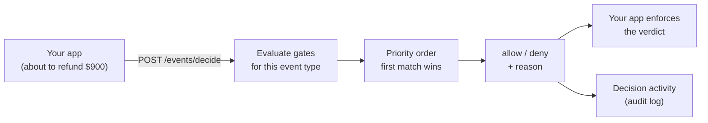

# Gates

Gates let your app **ask before it acts**. Your app posts a proposed action to Atelier,
Atelier evaluates the workspace's rules, and answers `allow` or `deny` **in the same
HTTP call** — so the policy lives in Atelier instead of scattered `if` statements across
your codebase.

> Not to be confused with [Triggers](using-event-workflows.md), which are **asynchronous**
> ("something happened → an agent reacts"). A gate is **synchronous** ("I'm about to do X
> → may I?"). Triggers run agents; gates run rules, and never call a model at decision
> time.



There are three pieces:

| Piece | What it is |
| --- | --- |
| **Gate (rule)** | "When event *X* matches these conditions, `deny` with this reason." |
| **Decide** | Your app calls `POST /api/v1/events/decide` and honors the answer. |
| **Decision activity** | Every verdict is recorded, with the rule that fired and the payload. |

Gates are **workspace-scoped**, like triggers and schedules.

---

## 1. Create a gate

Open **Gates** in the sidebar (under Automation) → **New gate**:

- **Name** — a short label, e.g. `High-value refund needs approval`
- **Event types** — which events this rule applies to, e.g. `refund.requested`
  (globs work: `refund.*`)
- **Action** — the verdict when the rule matches: **Deny** (block the action) or
  **Allow** (explicitly permit)
- **Reason** — the human-readable string returned to your app on a match
- **Conditions** — the AND/OR/NONE tree the payload must satisfy (below)
- **Priority** — higher is evaluated first; **the first matching rule decides**
- **Allow override** — marks a deny as a *soft* deny (`overridable: true`), so your app
  can offer a supervisor an override instead of a hard block
- **Enabled** — toggle on/off

You can also **describe the rule in plain English** ("block refunds over $500 unless the
user is an admin") and let an agent compile it into the fields and the condition tree for
you.

**If no rule matches, the default is `allow`.** A workspace with no gates never blocks
anything.

## 2. Conditions

A gate's conditions are a recursive tree. A node is either a **group** or a **leaf**:

```json
{
  "match": "all",
  "conditions": [
    { "field": "payload.user.role", "op": "ne", "value": "admin" },
    {
      "match": "any",
      "conditions": [
        { "field": "payload.amount",   "op": "gt", "value": 500 },
        { "field": "payload.currency", "op": "eq", "value": "USD" }
      ]
    }
  ]
}
```

| Group `match` | Meaning |
| --- | --- |
| `all` | AND — every child must match |
| `any` | OR — at least one child must match |
| `none` | NOR — no child may match |

**Leaf operators:** `eq`, `ne`, `gt`, `gte`, `lt`, `lte`, `in`, `not_in`, `contains`,
`not_contains`, `matches` (regex), `exists`, `not_exists`.

**Fields are dot paths** resolved against `{ "payload": <your payload>, "type": <event> }`
— e.g. `payload.user.role`, `payload.items.0.sku`, or `type`. Numeric segments index into
lists.

Evaluation is **total**: a missing field, a type mismatch, or a bad regex makes that leaf
`false` rather than raising, so a gate can never crash the request it guards. A missing
field is `true` only for the "field is not that" operators — `ne`, `not_in`,
`not_contains`. An **empty group never matches**, so an unconfigured gate is inert.

Comparisons (`gt`/`gte`/`lt`/`lte`) are numeric only, and booleans are deliberately *not*
treated as `1`/`0`.

## 3. Test before going live

Two dry runs, neither with side effects:

- **Live preview** — while editing a rule, a sample payload is evaluated against the
  unsaved conditions (`POST /api/v1/gates/evaluate`), showing whether it would fire.
- **Test the whole set** — `POST /api/v1/gates/test` with `{type, payload}` returns the
  final verdict **plus a per-gate trace** of which rule matched, so you can see exactly
  why a payload was allowed or denied.

## 4. Call it from your app

Call `decide` **before** you commit the action, and enforce the answer. There is no SDK —
any system that can make an HTTP call can use it.

**Python**

```python
import requests

verdict = requests.post(
    "http://localhost:8000/api/v1/events/decide",
    headers={"X-API-Key": "ate-..."},
    json={"type": "refund.requested", "payload": {"amount": 900, "user": {"role": "agent"}}},
).json()

if verdict["decision"] == "deny" and not verdict["overridable"]:
    raise PermissionError(verdict["reason"])
```

**Node**

```ts
const res = await fetch("http://localhost:8000/api/v1/events/decide", {
  method: "POST",
  headers: { "X-API-Key": "ate-...", "Content-Type": "application/json" },
  body: JSON.stringify({ type: "refund.requested", payload: { amount: 900 } }),
});
const verdict = await res.json();
```

**curl**

```bash
curl -X POST http://localhost:8000/api/v1/events/decide \
  -H "X-API-Key: ate-..." -H "Content-Type: application/json" \
  -d '{"type":"refund.requested","payload":{"amount":900}}'
```

**Response**

```json
{
  "event": "refund.requested",
  "decision": "deny",
  "reason": "Refunds over $500 need a supervisor.",
  "matched_gate_id": 7,
  "matched_gate_name": "High-value refund needs approval",
  "overridable": true,
  "evaluated": 3
}
```

| Field | Meaning |
| --- | --- |
| `decision` | `allow` or `deny` — what your app must enforce |
| `reason` | The matched rule's reason (empty when nothing matched) |
| `matched_gate_id` / `matched_gate_name` | Which rule decided, or `null` on the default allow |
| `overridable` | A soft deny — the caller may offer a human override |
| `evaluated` | How many gates were considered for this event type |

> Use a **per-user API key** (starts with `ate-`, from **Config → API key**), not the
> global `API_KEYS` value. The workspace comes from the `X-Workspace-Id` header, or your
> personal workspace by default.

## 5. Decision activity

Every `decide` call is written to an audit log — event type, verdict, the rule that fired,
the reason, and the payload. Open **Decision activity** on the Gates page, or
`GET /api/v1/gates/decisions`.

## Agents can manage gates too

Give an agent the built-in **`gate`** tools (Agent → Tools) and it can create, list,
update, and delete gates from chat, scoped to its workspace. Assign them deliberately —
an agent with these tools can also **weaken or delete existing guardrails**.

## Related

- [Triggers](using-event-workflows.md) — the asynchronous sibling: emit an event, an agent handles it
- [Webhooks](using-webhooks.md) — how async results get back to your app
- [Tools & Prompts](using-tools.md) — the built-in `gate` tools
