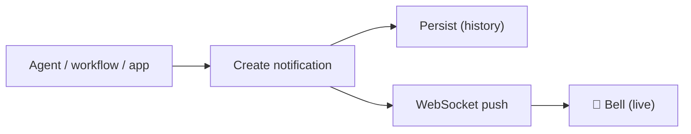

# Notifications

In-app notifications appear live in the **bell** in the top navigation, delivered over a
WebSocket. They're how agents, workflows, and the platform tell a user something happened.



---

## Where they show up

- **Bell** (top nav) — shows the **5 most recent** with an unread badge; updates live.
- **View all** → `/config/notifications` — full, paginated history with mark-read / mark-all-read.

Each notification has a **level** — `info`, `success`, `warning`, or `error` — which sets its
icon/colour, and an optional **source** (e.g. the agent that sent it).

## Send a notification from an agent

Give an agent the built-in **`notify`** tool (Agent → Tools → add `notify`). The agent can
then alert you:

```
notify(title="Reset done", body="Cleared 3 todos, added todo-1", level="success")
```

It's delivered to the agent's owner and tagged with the agent's name as the source. Pair it
with [Event Workflows](using-event-workflows.md) so a workflow notifies you when it runs.

## Send one programmatically

```bash
curl -X POST http://localhost:8000/api/v1/notifications \
  -H "X-API-Key: ate-..." -H "Content-Type: application/json" \
  -d '{"title":"Build finished","body":"All green","level":"success"}'
```

## API

| Method | Path | Purpose |
| --- | --- | --- |
| `GET`  | `/api/v1/notifications?limit=&offset=` | Paginated history (`{success, data, pagination}`) |
| `GET`  | `/api/v1/notifications/unread-count` | Unread badge count |
| `POST` | `/api/v1/notifications` | Create one for yourself |
| `POST` | `/api/v1/notifications/{id}/read` | Mark one read |
| `POST` | `/api/v1/notifications/read-all` | Mark all read |
| `WS`   | `/api/v1/notifications/ws?token=…` | Live stream (token = Google id token or `?api_key=`) |
