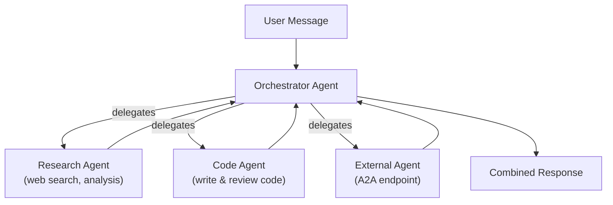

# Orchestration

The Orchestrator lets you build multi-agent workflows where a central agent coordinates multiple sub-agents to handle complex tasks. Instead of one agent doing everything, you can decompose work across specialized agents.

---

## How It Works

The orchestrator is a special agent type that has access to other agents as sub-agents. When it receives a message, it decides which sub-agent(s) to call based on the task, collects their responses, and synthesizes a final answer.

1. **You send a message** to the orchestrator
2. The orchestrator's LLM **analyzes the task** and decides which sub-agents to involve
3. It **delegates** parts of the task to the appropriate sub-agents
4. Each sub-agent **runs independently** and returns its result
5. The orchestrator **combines the results** into a coherent response

The orchestrator agent itself has a system prompt and model — it uses its own intelligence to decide how to coordinate.

---

## Setting Up an Orchestrator

### Step 1: Create Sub-Agents

Before building an orchestrator, create the agents you want to coordinate. Each sub-agent should have a clear, focused purpose:

- A **research agent** with web search tools
- A **code agent** with file tools and Claude Code
- A **data agent** with database connections
- An **external agent** via A2A (Agent-to-Agent) protocol

### Step 2: Open the Orchestrator

1. Go to **Orchestration** in the sidebar
2. You'll see a visual canvas with the orchestrator node in the center

### Step 3: Add Sub-Agents

1. Use the sidebar panel to add sub-agents
2. **Local agents** — Select from agents in your workspace
3. **External A2A agents** — Enter the Agent-to-Agent endpoint URL
4. Each sub-agent appears as a node on the canvas

### Step 4: Connect Agents

- The orchestrator node has a **source handle** (bottom edge)
- Each sub-agent has a **target handle** (left edge)
- **Drag** from the orchestrator to a sub-agent to create a connection
- Only connected sub-agents are available to the orchestrator at runtime

### Step 5: Configure and Save

- Click the orchestrator node to edit its system prompt and model
- Describe in the system prompt how it should coordinate — which agent handles what
- Save changes

---

## Using the Orchestrator

Once configured, interact with the orchestrator like any other agent in the Chat tab. Send it a message and it will coordinate across your sub-agents automatically.

### Example Prompts

| Prompt | What happens |
|--------|-------------|
| "Research the latest React 19 changes and write a migration guide" | Orchestrator sends research to the research agent, then passes findings to the code agent for the guide |
| "Analyze our database schema and suggest optimizations" | Orchestrator queries the data agent for schema info, then asks the code agent for optimization suggestions |
| "Check the GitHub issues and summarize the bugs filed this week" | Orchestrator delegates to an external agent with GitHub MCP tools |

### Tips for Good Orchestration

- **Give each sub-agent a clear role** — The orchestrator works best when agents have distinct, non-overlapping capabilities
- **Write a descriptive system prompt** — Tell the orchestrator which agent to use for what: "Use the research agent for information gathering and the code agent for writing code"
- **Use agent descriptions** — The orchestrator reads sub-agent descriptions to decide who to call, so make them specific

---

## Editing the Canvas

- **Inspect capabilities** — Tool and skill labels appear on each local agent node; hover them to see the complete list
- **Inspect an agent** — Click a node to open its model, capabilities, and actions in the inspector
- **Chat or edit** — Use the explicit actions in the inspector; testing the orchestrator is also available from the studio toolbar
- **Remove a node** — Use the remove control on the node or in the sidebar panel
- **Remove a connection** — Click an edge and press delete, or use the edge's remove button
- **Rearrange** — Drag nodes to organize the canvas; positions are saved automatically

---

## Local vs External Agents

| Type | Description | Use case |
|------|-------------|----------|
| **Local** | Agents in your workspace | Full control, shared tools and memory |
| **External A2A** | Remote agents via URL | Cross-team agents, third-party services, agents on other KRIY instances |

External A2A agents communicate via the Agent-to-Agent protocol — they can run on different servers or even different platforms.

---

## Workspace Scoping

- The orchestrator agent belongs to a workspace, just like regular agents
- Only sub-agents within the same workspace (or external A2A endpoints) can be added
- See [Workspaces](using-workspaces.md) for details on workspace scoping
