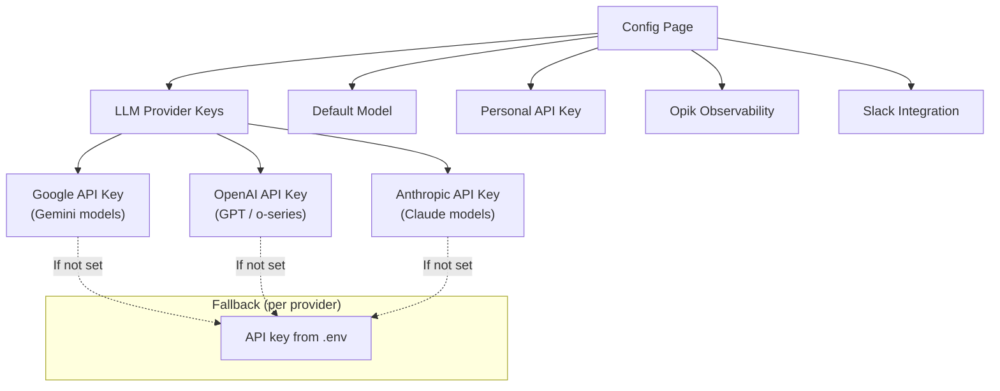

# Configuration

## Overview



The Configuration page is your central place to manage API keys, integrations, and personal settings.

1. Go to **Config** in the sidebar
2. View and update your settings

---

## LLM Provider Keys

Atelier supports multiple LLM providers. Set the API key for each provider you want to use.

### Google API Key (Gemini)

- For models: `gemini-3.1-flash-lite`, `gemini-2.5-pro`, `gemini-2.0-flash`, `gemini-1.5-pro`, etc.
- Get a key at [Google AI Studio](https://aistudio.google.com/app/apikey)

### OpenAI API Key (GPT / o-series)

- For models: `gpt-4o`, `gpt-4o-mini`, `gpt-4-turbo`, `o3-mini`, etc.
- Get a key at [OpenAI Platform](https://platform.openai.com/api-keys)
- Uses LiteLLM under the hood for API translation

### Anthropic API Key (Claude)

- For models: `claude-sonnet-4-20250514`, `claude-haiku-4-20250414`, etc.
- Get a key at [Anthropic Console](https://console.anthropic.com/settings/keys)
- Uses LiteLLM under the hood for API translation

### How It Works

1. When an agent runs, the system detects the provider from the model name prefix
2. It looks up your personal key for that provider (from Config page)
3. If no personal key is set, it falls back to the server's `.env` key
4. The key is temporarily set in the environment for the duration of the request

### Fallback Priority

```
Your personal key (Config page) > Server .env key > Error
```

---

## Default Model

Choose which model new agents default to. Available options include models from all supported providers:

- **Google:** gemini-3.1-flash-lite, gemini-2.5-pro, gemini-2.0-flash, gemini-1.5-flash, gemini-1.5-pro
- **OpenAI:** gpt-4o, gpt-4o-mini, gpt-4-turbo, o3-mini
- **Anthropic:** claude-sonnet-4-20250514, claude-haiku-4-20250414

---

## Personal API Key

Generate a personal API key to integrate your agents into external systems (Slack, Discord, custom apps).

1. Go to **Config** > **API Key**
2. Click **Generate API Key**
3. Copy the key immediately (it won't be shown again)
4. Use the `X-API-Key` header when calling the API

---

## Opik Observability

Connect to [Opik](https://www.comet.com/opik) to trace and monitor agent runs.

1. Toggle **Enable Opik Tracing**
2. Enter your **Opik API Key**, **Workspace**, and **Project Name**
3. Optionally set an **API URL Override** for self-hosted Opik
4. Save

---

## Slack Integration

Configure Slack so incoming messages are answered by an agent.

1. Toggle **Enable Slack Integration**
2. Enter **Bot Token** (`xoxb-...`), **Signing Secret**, and optionally **App Token** (`xapp-...`)
3. Set **Bot User ID** and **Default Agent**
4. Set your Slack Events Request URL to `/api/v1/slack/events` on this backend
5. Save

Once configured, incoming Slack messages to your bot are routed to the default agent, and the agent's response is posted back to the channel.
