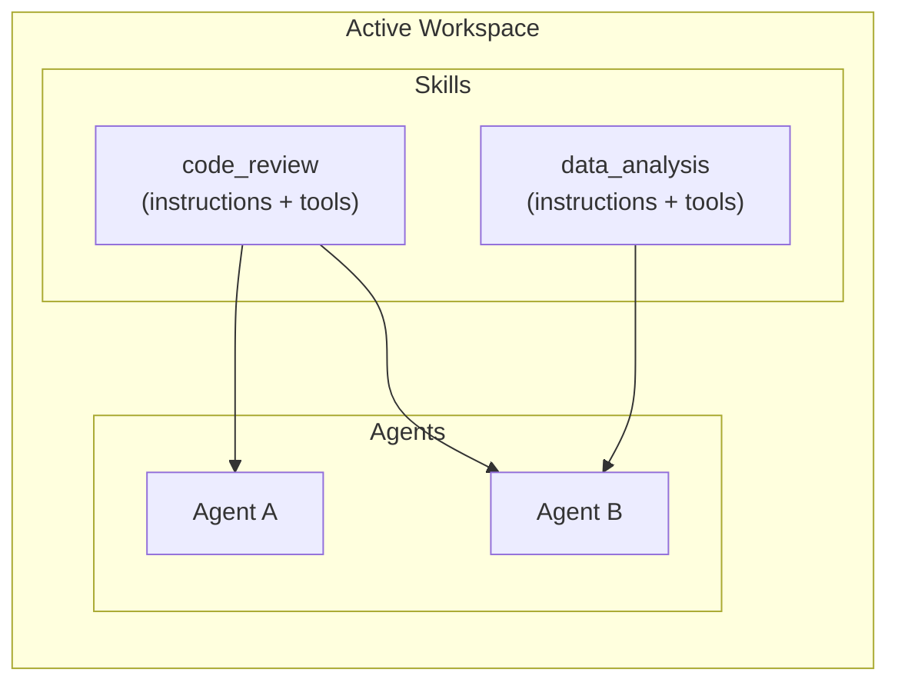
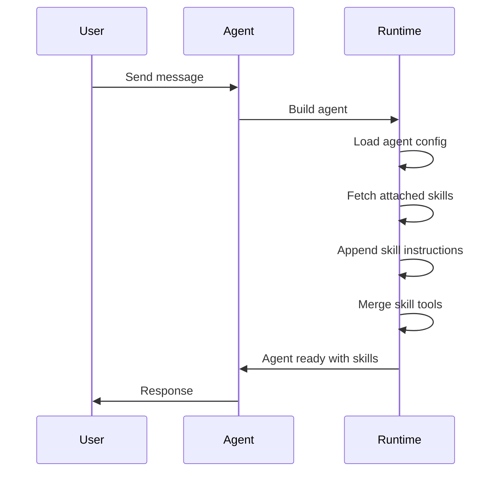

# Skills

## Overview

Skills are reusable capability definitions that can be attached to agents. A skill bundles **instructions** and optional **tool references** into a shareable unit, stored per workspace. When an agent runs with skills attached, the skill instructions and tools are injected into the agent at runtime.

---

## What is a Skill?

| Field | Purpose |
|-------|---------|
| **Name** | Identifier for the skill |
| **Description** | What the skill does (for discovery/selection) |
| **Instructions** | Core guidance text injected into the agent's context when active |
| **Tools** | Optional tool configs (built-in, MCP, database) bundled with the skill |

Skills are **workspace-scoped** — they belong to the active workspace and are shared with all workspace members.

---

## Create a Skill

1. Go to **Skills** in the sidebar
2. Click **New Skill**
3. Fill in:
   - **Name** — A unique identifier (e.g. `code_review`)
   - **Instructions** — The guidance text for this capability
4. Click **Create** or **Create & Edit** to configure tools

---

## Configure a Skill

On the skill detail page you can configure:

- **Name** and **Description**
- **Instructions** — The core text injected into agents using this skill
- **Tools** — Attach built-in tools, MCP connections, or database connections

### Tools

- **Built-in** — Select from available built-in tools (e.g. search, code execution)
- **MCP** — Connect to MCP servers and select specific tools
- **Database** — Attach PostgreSQL connections for SQL tools

---

## Attach Skills to an Agent

1. Open an agent → **Configuration** tab
2. Find the **Skills** section
3. Check the skills you want to attach
4. Click **Save Changes**

When the agent runs, all attached skill instructions are appended to the agent's instruction text under a "Skills" section, and skill tools are merged into the agent's tool list.

---

## Workspace Scoping

- Skills are scoped to the **active workspace** — you only see skills belonging to the workspace selected in the sidebar
- When you create a skill, it is assigned to the active workspace
- Skills can be shared across multiple agents within the same workspace
