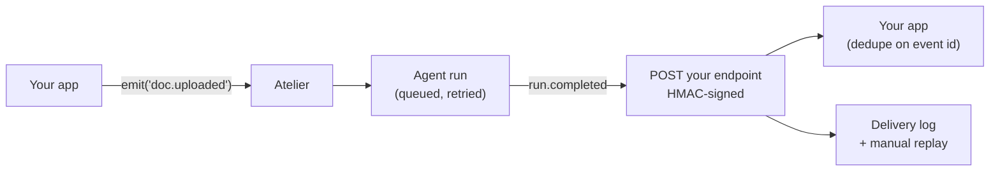

# Webhooks

Webhooks are the **outbound** half of Atelier's integration surface. Your app emits events
*in* ([Triggers](using-event-workflows.md)); Atelier posts platform events back *out* — so
when a triggered agent finishes, its **result reaches your app** instead of sitting in
Atelier.



| Direction | Synchronous | Asynchronous |
| --- | --- | --- |
| Inbound (your app → Atelier) | [`POST /events/decide`](using-gates.md) — a gate verdict | `POST /events` — an event that triggers agents |
| Outbound (Atelier → your app) | REST API (you poll) | **Webhooks** — this page |

> Webhooks carry **platform events** ("a run completed"). They're not how an agent *takes
> actions* in the world — that's what tools, MCP, and `call_api` are for.

---

## 1. Subscribe an endpoint

Open **Webhooks** in the sidebar (under Automation) → **New webhook**:

- **Endpoint URL** — where Atelier POSTs the signed event. Must be a public `https` URL in
  production; internal and cloud-metadata hosts are blocked (SSRF guard), and `localhost`
  is allowed only in development.
- **Events** — which event types to receive. Globs work: `run.completed`, `gate.*`,
  `run.*`. At least one is required.
- **Enabled** — toggle delivery on/off without deleting the subscription.

The **signing secret is shown once**, on create and on rotate. Store it immediately —
afterwards only a hint (`…4f9c`) is returned. Use **Rotate secret** on the list to issue a
new one.

Subscriptions are **workspace-scoped**.

## 2. Event catalog

| Event | Status | Payload `data` |
| --- | --- | --- |
| `run.completed` | **Live** | `run_id`, `workflow_id`, `workflow_name`, `event_type`, `status`, `result`, `event_payload` |
| `run.failed` | Subscribable, not yet emitted | — |
| `gate.decided` | Subscribable, not yet emitted | — |

`run.completed` fires from the event worker after a triggered workflow run finishes, and
carries the agent's output as `result`.

## 3. The envelope

Every delivery is a JSON body in this shape — a stable public contract:

```json
{
  "id": "evt_9f2c…",
  "type": "run.completed",
  "created_at": "2026-08-09T10:00:00+00:00",
  "correlation_id": "APP-1013",
  "data": {
    "run_id": 42,
    "workflow_id": 7,
    "workflow_name": "Handle uploaded documents",
    "event_type": "document.uploaded",
    "status": "done",
    "result": "…agent output…",
    "event_payload": { "…": "the payload you emitted" }
  }
}
```

`correlation_id` is lifted from the payload you emitted (first of `correlation_id`,
`application_id`, or `id`), so you can tie a result back to the request that started it.

Headers on every POST:

| Header | Value |
| --- | --- |
| `Content-Type` | `application/json` |
| `X-Atelier-Event` | the event type, e.g. `run.completed` |
| `X-Atelier-Signature` | `t=<unix>,v1=<hex>` — see below |

## 4. Verify the signature

`v1 = HMAC_SHA256(secret, "<t>.<raw request body>")`. Compute it over the **raw** body
bytes — not a re-serialized parse — and reject timestamps older than ~5 minutes to block
replays.

**Python (FastAPI)**

```python
import hashlib, hmac, time

def verify(secret: str, body: str, header: str, tolerance: int = 300) -> bool:
    parts = dict(p.split("=", 1) for p in header.split(","))
    ts = int(parts["t"])
    if abs(time.time() - ts) > tolerance:
        return False
    expected = hmac.new(secret.encode(), f"{ts}.{body}".encode(), hashlib.sha256).hexdigest()
    return hmac.compare_digest(expected, parts.get("v1", ""))


@app.post("/atelier/webhook")
async def receive(request: Request):
    raw = (await request.body()).decode()
    if not verify(WHSEC, raw, request.headers["X-Atelier-Signature"]):
        raise HTTPException(401, "bad signature")
    ...
```

**Node (Express)**

```ts
import crypto from "node:crypto";

// mount with express.raw({ type: "application/json" }) so `req.body` stays a Buffer
app.post("/atelier/webhook", express.raw({ type: "application/json" }), (req, res) => {
  const parts = Object.fromEntries(
    req.header("X-Atelier-Signature")!.split(",").map((p) => p.split("=", 2))
  );
  const body = req.body.toString();
  const expected = crypto
    .createHmac("sha256", process.env.WHSEC!)
    .update(`${parts.t}.${body}`)
    .digest("hex");

  const ok =
    Math.abs(Date.now() / 1000 - Number(parts.t)) <= 300 &&
    crypto.timingSafeEqual(Buffer.from(expected), Buffer.from(parts.v1));
  if (!ok) return res.sendStatus(401);

  res.sendStatus(200); // ack fast, then process
});
```

## 5. Delivery semantics

- **At-least-once.** Your handler **must dedupe on the envelope `id`** — treat it as an
  idempotency key.
- Delivery runs **off the request path**, so a slow endpoint never blocks an agent run.
- A non-2xx response or a network error is retried inline (bounded, short). Durable
  long-backoff redelivery is planned; until then, failed deliveries are **replayed
  manually**.
- **Every attempt is logged** — status, HTTP code, attempt count, and the error. Open
  **Deliveries** on a subscription to see them, and **Replay** to re-send one.
- Return `2xx` as soon as you've persisted the event; do the work afterwards. The delivery
  timeout is 10 seconds.

## 6. API surface

| Endpoint | What it does |
| --- | --- |
| `GET /api/v1/webhooks` | List subscriptions (secret hint only) |
| `POST /api/v1/webhooks` | Create — **returns the secret once** |
| `PUT /api/v1/webhooks/{id}` | Update URL, events, enabled |
| `POST /api/v1/webhooks/{id}/rotate-secret` | New secret, **returned once** |
| `DELETE /api/v1/webhooks/{id}` | Delete |
| `GET /api/v1/webhooks/{id}/deliveries` | Delivery log (default 100, max 500) |
| `POST /api/v1/webhooks/deliveries/{id}/replay` | Re-send a past delivery |

```bash
curl -X POST http://localhost:8000/api/v1/webhooks \
  -H "X-API-Key: ate-..." -H "Content-Type: application/json" \
  -d '{"url":"https://api.acme.com/atelier","event_types":["run.completed"]}'
```

> Use a **per-user API key** (starts with `ate-`, from **Config → API key**). The workspace
> comes from the `X-Workspace-Id` header, or your personal workspace by default.

## No endpoint to expose?

Polling stays the zero-config fallback — read a run's status and result from
`GET /api/v1/workflows/runs/{id}` instead of subscribing.

## Related

- [Triggers](using-event-workflows.md) — the inbound half: emit an event, an agent handles it
- [Gates](using-gates.md) — synchronous allow/deny before your app acts
- [Outbound webhooks — design note](outbound-webhooks-design.md) — the architecture and roadmap
